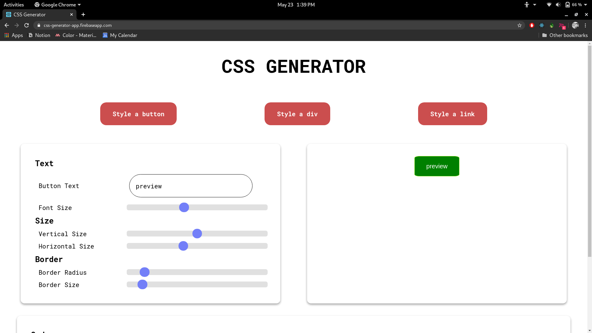
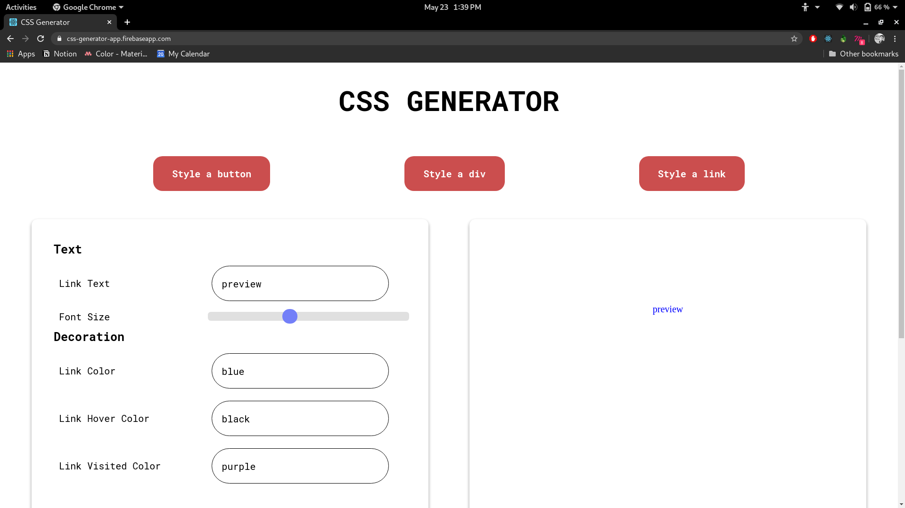

# CSS Generator 🖌️

A simple project which will help developers design web elements and generate the equivalent CSS for it. 

Built by the **Web Team - DSC KIIT**.

## Development Setup

It's a regular React app bootstrapped using `create-react-app`

* `npm i` to install all the dependencies
* `npm start` to start the local dev server

Feel free to suggest features and open PR's. We would love that.

## Screenshots

    

 

    

 

## LICENSE
Copyright (c) **DSC KIIT**. All rights reserved. Licensed under the MIT License

 

    

